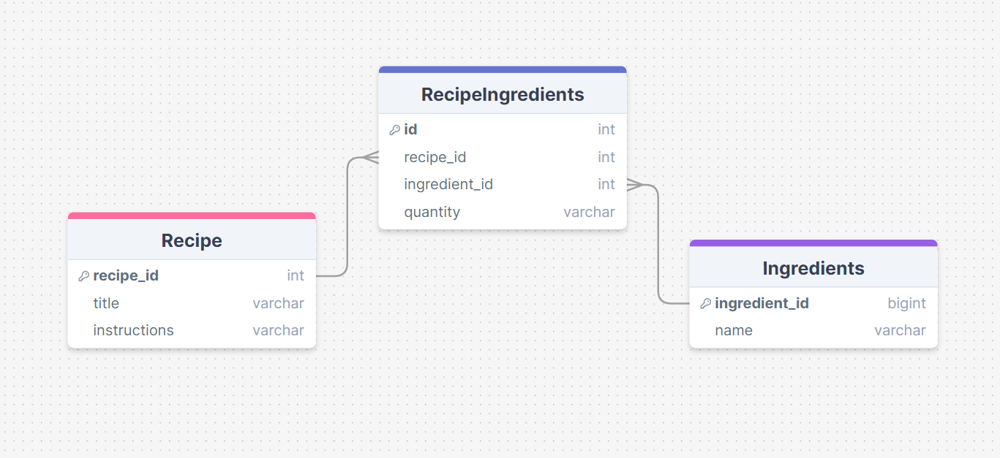

# Recipe Management System

## Overview

The Recipe Management System is a Spring Boot application that allows users to manage recipes and their ingredients. It provides functionality to add, update, and retrieve recipes and their associated ingredients.

## Features

- Add new recipes with ingredients
- Update ingredient quantities in recipes
- Retrieve all ingredients for a specific recipe
- Comprehensive error handling

## ER Diagram

The following ER diagram illustrates the database schema for the Recipe Management System:

